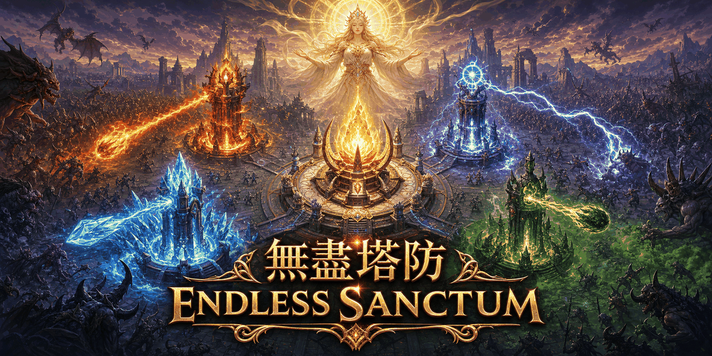
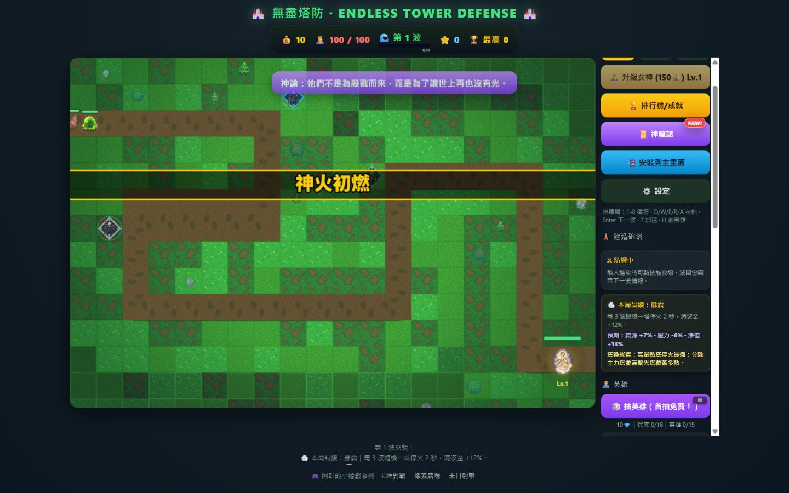
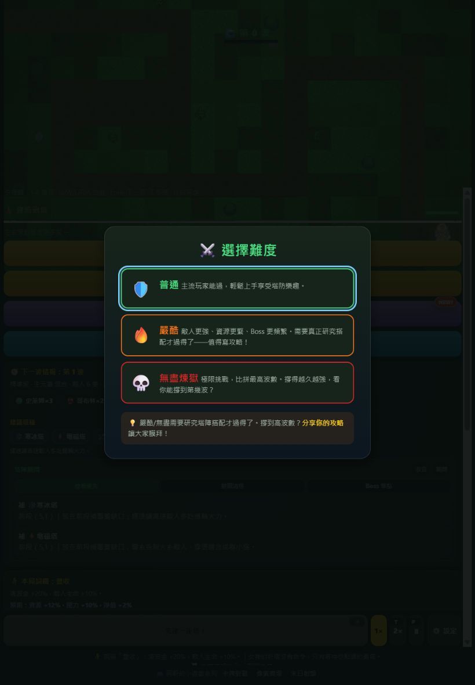
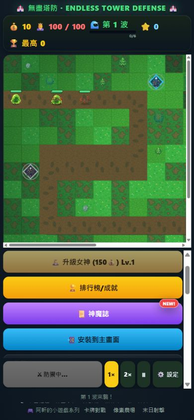

# 無盡塔防 · Endless Tower Defense

[](https://github.com/mars-tw/tower-defense-skill/actions/workflows/ci.yml)
[](LICENSE)
[](package.json)
[](https://mars-tw.github.io/tower-defense-skill/)



以原生 JavaScript 與 Canvas 2D 製作的無盡塔防遊戲。建造元素高塔、召喚神話英雄、升級守護女神，迎戰帶有事件與詞綴的無盡妖魔浪潮；每局成果會累積至英雄羈絆、排行榜與成就。

**[立即線上遊玩](https://mars-tw.github.io/tower-defense-skill/)**

目前版本：`0.6.7`／PWA 快取版本 `td-r67-v1`（R67）。

## 遊戲畫面

| 桌機戰鬥 | 平板開局 | 手機戰鬥 |
|---|---|---|
|  |  |  |

## 最新特色

- **R67 施法、地圖與新手引導整修**：主動技能改為有效命中才消耗冷卻，觸控可取消；塔陣顧問與實際封路共用格位判定，並加入可重訪實戰教學、程序化音效與音量設定。
- **R61 十塔統一畫風**：弓箭、加農、寒冰、電磁、毒霧、聖光、引魂、狙擊、奧術與墜星臼砲採一致的 Eastern Dark Fantasy 3/4 視角美術。
- **R62 敵人真幀動畫**：18 種敵人全數採 atlas 裁切步態，普通敵 4 幀、Boss 6 幀，另有受擊白閃與三幀碎裂死亡反應。
- **神話英雄卡池**：15 位英雄，包含妲己、魔關羽、孫悟空、哪吒、雷震子、牛魔王、白素貞、二郎神與鍾馗；首抽免費、18 抽傳說保底，重複英雄轉為魂晶。
- **女神升級**：守護女神最高 Lv.8；升級增加生命並回滿，Lv.2 起解鎖自動聖擊。
- **波次詞綴與事件**：每局從濃霧、餘震、豐收、超載、魔潮、血月抽取風險／報酬詞綴，並穿插狂奔、精英、蟲潮、寶藏等事件波。
- **排行榜與成就**：依難度與地圖分榜記錄前 10 名，另有 14 項長期成就、首 10 波新手任務與英雄羈絆成長。
- **PWA 與離線遊玩**：支援安裝至主畫面；首次成功載入資源後可離線開啟，Service Worker 會管理版本化快取。
- **三地圖 × 三難度**：翠綠平原、迂迴峽谷、熔岩峽道，以及普通、嚴酷、無盡煉獄。

## 如何遊玩

1. 選擇難度與地圖；快速開始會使用普通難度與翠綠平原。
2. 選塔後點擊路徑旁的合法格位建造，按 Enter 迎接下一波。
3. 依敵人元素與特性配置火、冰、雷、物理塔，並利用控場、易傷與支援效果。
4. 波次進行中可施放主動技能救場；清波取得金幣與魂晶，用於升塔、升級女神及抽取英雄。
5. 將英雄部署上場並設定駐守點，盡可能守住路徑終點的女神。

### 鍵盤快捷鍵

| 按鍵 | 功能 |
|---|---|
| `1`–`8` | 選擇弓箭塔、加農砲、寒冰塔、電磁塔、毒霧塔、聖光塔、狙擊塔、奧術塔 |
| `9`／`0` | 選擇引魂燈塔／墜星臼砲 |
| `Q`／`W`／`E` | 隕石術／冰封術／雷暴術 |
| `R`／`A` | 神聖裁決／封魔陣 |
| `Enter` | 開始下一波 |
| `Space`／`P` | 暫停或繼續 |
| `T` | 切換 1×／2× 速度 |
| `H` | 抽英雄 |
| `Esc` | 取消目前的建塔或施法選擇 |

滑鼠與觸控均可操作；窄螢幕上的塔、英雄與技能列可左右滑動。

## 技術棧

- HTML5、CSS3、Vanilla JavaScript、Canvas 2D
- `localStorage` 存檔、Web App Manifest、Service Worker／Cache API
- Node.js 純函式與結構測試
- Playwright Chromium E2E／RWD 測試
- GitHub Actions CI 與 GitHub Pages 部署

遊戲執行階段不依賴前端框架或第三方 JavaScript 套件。

## 本地開發

需求：Node.js 20+、npm、Python 3。第一次執行 E2E 前需安裝 Playwright Chromium。

```bash
git clone https://github.com/mars-tw/tower-defense-skill.git
cd tower-defense-skill
npm ci
npx playwright install chromium
npm start
```

開啟 <http://localhost:8000/>。請透過 HTTP server 執行，避免直接以 `file://` 開啟而使 PWA／模組資源行為與正式環境不同。

### npm scripts

| 指令 | 用途 |
|---|---|
| `npm start` | 以 Python HTTP server 在連接埠 8000 啟動遊戲 |
| `npm test` | 執行 config、英雄、規則、排行榜、平衡與世界觀測試 |
| `npm run test:e2e` | 執行桌機、平板、手機與矮桌機的 Playwright 功能驗證 |
| `npm run test:rwd` | 執行 9 種視口的版面、捲動與水平溢出檢查 |

CI 會在 push／pull request 執行單元測試、E2E 與 RWD 守門；`main` 通過後才部署 GitHub Pages。

## 專案結構

| 路徑 | 說明 |
|---|---|
| `index.html` | 頁面結構、HUD、RWD 樣式與 PWA 註冊 |
| `src/config.js` | 塔、敵人、技能、女神、地圖、難度、詞綴與成就設定 |
| `src/rules.js` | 波次、存檔遷移、排行榜、獎勵與純規則函式 |
| `src/heroes.js` | 英雄卡池、稀有度、保底與英雄資料 |
| `src/game.js` | Canvas 遊戲迴圈與戰鬥系統 |
| `src/ui.js` | HUD、快捷鍵、英雄、排行榜與設定介面 |
| `scripts/` | Node.js 測試、Playwright E2E 與平衡模擬 |
| `docs/` | 開發報告、審查記錄與驗收證據 |

## 素材、貢獻與授權

素材來源、AI 產出標註與第三方授權請見 [CREDITS.md](CREDITS.md)。提交變更前請至少執行 `npm test`；涉及 UI 或互動時再執行 `npm run test:e2e`。

程式碼與專案自有素材依 [MIT License](LICENSE) 釋出（在權利適用範圍內）。© 2026 mars-tw。
