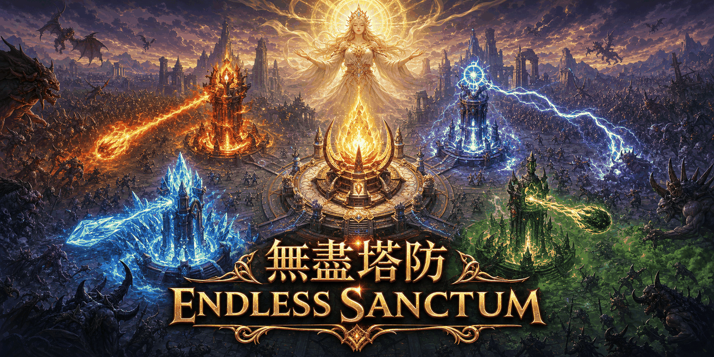
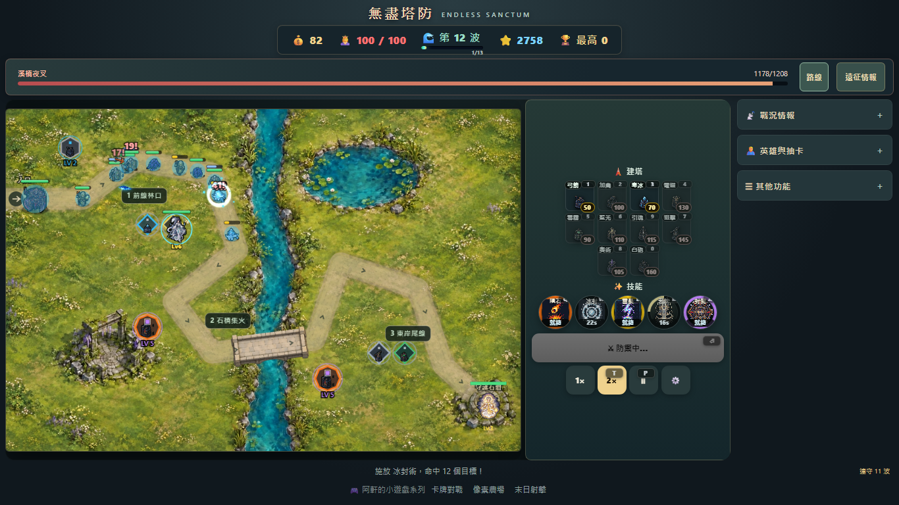
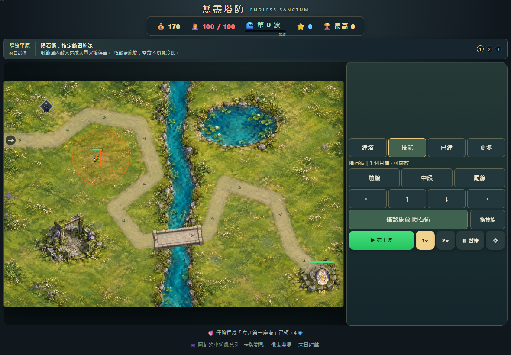
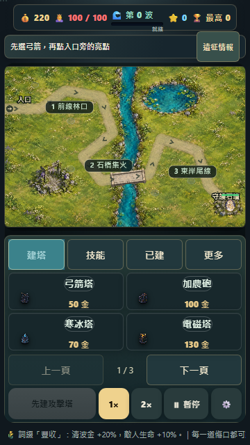

# 無盡塔防 · Endless Tower Defense

[](https://github.com/mars-tw/tower-defense-skill/actions/workflows/ci.yml)
[](LICENSE)
[](package.json)
[](https://mars-tw.github.io/tower-defense-skill/)



以原生 JavaScript 與 Canvas 2D 製作的塔防遊戲。建造元素高塔、召喚神話英雄、升級守護女神，挑戰十二波遠征或無盡妖魔浪潮；每局成果會累積至英雄羈絆、通關紀錄與成就。

**[立即線上遊玩](https://mars-tw.github.io/tower-defense-skill/)**

目前版本：`0.12.2`／PWA 快取版本 `td-r84-v3`。詳見 [版本說明](docs/RELEASE-0.12.2.md)。

## 遊戲畫面

| 桌機戰鬥 | 平板技能預覽 | 手機控制盤 |
|---|---|---|
|  |  |  |

## 最新特色

- **R84 手機與平板控制盤**：依觸控能力啟用，寬螢幕平板也有完整定位列。建塔、技能、已建塔及其他功能分頁顯示；選項採完整名稱與大按鈕，技能先預覽範圍再確認，已建塔可由列表直接檢視。操作時可自動暫停規劃，取消後保留原先的手動暫停狀態。

[R84 觸控控制盤改善](docs/RELEASE-0.12.2.md)

- **R83 手機建塔**：選塔後可用「建議位」預覽、四方向逐格微調與底部大確認鈕；附近無效位置只會有限對齊合法格，拖曳或微調不會自動扣錢。建好後返回選塔列，下一次點塔可開啟升級資訊。

[R83 手機建塔改善](docs/RELEASE-0.12.2.md)

- **R82 三套遠征**：溪橋守望、裂谷封鎖、熔心封印各有十二波敵群與四段壓力，第十二波守住後完成戰役。無盡守城繼續保留。
- **R82 本局祝福**：第 3、6、9 波後，各從三張未持有的祝福中選一張。十二種效果涵蓋物理穿透、範圍炮火、冰雷配合、經濟、技能與英雄；下一局重新選擇。
- **R82 可選契約**：波間可讓敵人加速、增加援軍，或禁用主動技能；守完該波才得額外賞金。也能選穩定守波，維持正常規則。
- **R82 通關與存檔**：遠征完成次數與最佳分數獨立保存，可匯出與匯入。選卡會暫停戰場，勝利後可重玩或接下一張遠征。

[R82 內容與玩家稽核](docs/RELEASE-0.12.2.md)

- **R81 操作交接**：手機塔與女神資訊移到控制盤，保留技能／波控並提供返回按鈕。首抽收下後接英雄上場列表，顧問建塔直接接回戰場確認。
- **R81 清楚的戰場**：Boss 血量與警示顯示在戰術列，連殺與連續守波移到頁尾；神諭保留在日誌與神魔誌，保留完整地圖供玩家觀察。
- **R81 導航成本**：以 min-heap 搜尋路徑，減少重複地形與視線判斷；保留橋面足跡與攻擊命中時序。

[R81 美術與玩家稽核](docs/RELEASE-0.12.2.md)

- **R80 地圖重製**：溪谷、裂谷、熔岩使用三張獨立手繪地景，保留完整地形預覽；泥路、石橋與入口／石壇標示依實際路線定位，不再鋪滿棋盤格與巨型腳印。
- **R80 防守動線**：前線、交火點與尾線各有角色。河流、裂谷、熔岩與遺跡依完整塔基禁止建造，橋口和回轉段提供不同射界；地形不靠全畫面遮色區分。
- **R80 英雄走位**：英雄駐守、追敵與返程會繞過障礙並走橋，非法駐守點會拒絕。路線圖、建塔提示與導航共用 `MAPS` 幾何，地景與路線提示各自快取。

[R80 地圖重製與實玩稽核](docs/RELEASE-0.12.2.md)

- **R79 精準建塔**：手機按住戰場會顯示三格放大預覽，拖曳以半速微調；放開只保留預覽，再按確認或點同格才扣款。短拖曳、多指、取消與轉向均有防誤建守門。
- **R79 戰術與戰況**：攻擊塔可選預設、最前、Boss 或高血量目標；戰場顯示 Boss 血量與剩餘敵人，波間戰報提供擊殺、漏怪、收入、傷害來源與有成本的補強建議。
- **R79 手機閱讀不中斷防線**：資訊抽屜會自動暫停，關閉後恢復原狀；保留手動暫停，並處理切抽屜、設定／抽卡交接和轉向。原生鍵盤可操作目標優先與確認按鈕。

R79 實玩、來源版本與中後期矩陣見 [R79 改善報告](docs/RELEASE-0.12.2.md)。

- **R78 每局戰役任務**：九段守望推進到第 40 波，之後每 5 波接新任務。七種戰術依局種子安排，進度與下一步常駐主畫面；錯過戰術也能繼續主線。獎勵有領取帳本，存檔失敗會等儲存恢復後補發一次。
- **R78 畫面與操作**：三地圖使用各自的地面色調，降低草地方格噪點；指揮盤改為青銅與玉綠色階。塔種、技能與建塔輪盤都有短名，選塔時直接顯示用途與數值。手機預覽有放大格框、十字與二次確認提示；英雄入口保留可見空間。
- **R78 流暢度**：單一 RAF 配合 60 Hz 固定邏輯與顯示插值，修正轉角、出怪與射擊冷卻遺失的餘量；背景分頁停表，靜態場景快取。首波只有支援塔時會提示補攻擊塔或派出戰鬥英雄。

R78 本機驗收與模擬體驗紀錄見 [改善報告](docs/RELEASE-0.12.2.md)。

- **R72 三地圖選擇與載入視覺**：既有翠綠平原、迂迴峽谷、熔岩峽道各有 imagegen banner 與 loading 真圖，提供 low／med／high 響應式版本；未新增地圖、玩法或解鎖。路徑帶採命令化對比守門，loading 納入 R71 modal 互鎖與 PWA 離線清單。
- **R71 選單互斥與重疊修復**：教學／難度／地圖／設定開啟時背景 app shell 進入 inert，教學改為不透明遮罩並暫藏戰鬥 toast；手機塔陣顧問依 dock 即時位置保留安全區，浮層開啟時背景控制不得命中。
- **R70 Wave 1 視覺量產**：15 位英雄以 atlas identity 產製 UI 肖像，全面取代 emoji 頭像；10 塔加入 Lv1–3／4–6／7+ 三級剪影外觀，並以 45/45 alpha gate、contact sheet 與 hash manifest 守門。
- **R69 稽核清理**：美術生成清單同步 10 塔、18 敵、15 英雄與 3 地圖；英雄生成提示改透明背景，並補上顧問恢復、戰鬥 log 展開與手機建塔短名。
- **R68 地圖完整顯示**：戰場與建塔/技能/波次控制改為保留空間的版面列；矮寬裝置採側置 dock，直式手機採底部 dock，960×640 棋盤在所有守門視口完整可見且不被 UI 覆蓋。
- **R67 施法、地圖與新手引導整修**：主動技能改為有效命中才消耗冷卻，觸控可取消；塔陣顧問與實際封路共用格位判定，並加入可重訪實戰教學、程序化音效與音量設定。
- **R66 觸控控制硬化**：手機/平板保留 44px 以上主要控制目標，建塔、技能、暫停、設定與抽卡入口在短螢幕視口皆可達。
- **R65 像素 polish**：塔、地圖、icon 與 palette 重新整理，減少素材底色方塊並強化戰場讀取。
- **R63 英雄真幀攻擊**：英雄 atlas 支援行走與攻擊 anticipation/impact/recovery，傷害落在 impact frame。
- **R61 十塔統一畫風**：弓箭、加農、寒冰、電磁、毒霧、聖光、引魂、狙擊、奧術與墜星臼砲採一致的 Eastern Dark Fantasy 3/4 視角美術。
- **R62 敵人真幀動畫**：18 種敵人全數採 atlas 裁切步態，普通敵 4 幀、Boss 6 幀，另有受擊白閃與三幀碎裂死亡反應。
- **神話英雄卡池**：15 位英雄，包含妲己、魔關羽、孫悟空、哪吒、雷震子、牛魔王、白素貞、二郎神與鍾馗；首抽免費、18 抽傳說保底，重複英雄轉為魂晶。
- **女神升級**：守護女神最高 Lv.8；升級增加生命並回滿，Lv.2 起解鎖自動聖擊。
- **波次詞綴與事件**：每局從濃霧、餘震、豐收、超載、魔潮、血月抽取風險／報酬詞綴，並穿插狂奔、精英、蟲潮、寶藏等事件波。
- **排行榜與成就**：依難度與地圖分榜記錄前 10 名，另有 14 項長期成就、首 10 波新手任務與英雄羈絆成長。
- **PWA 與離線遊玩**：支援安裝至主畫面；首次成功載入資源後可離線開啟，Service Worker 會管理版本化快取。
- **三地圖 × 三難度**：翠綠平原、迂迴峽谷、熔岩峽道，以及普通、嚴酷、無盡煉獄。

## 如何遊玩

1. 選擇難度、遠征／無盡玩法與地圖；快速開始使用普通難度、翠綠平原與目前選定玩法，首次預設遠征。
2. 選塔後點擊路徑旁的合法格位建造，按 Enter 迎接下一波。
3. 依敵人元素與特性配置火、冰、雷、物理塔，並利用控場、易傷與支援效果。
4. 波次進行中可施放主動技能救場；清波取得金幣與魂晶，用於升塔、升級女神及抽取英雄。
5. 將英雄部署上場並設定駐守點，盡可能守住路徑終點的女神。
6. 遠征第 3、6、9 波後選擇本局祝福；波間可在「遠征情報」選擇下一波契約。守住第十二波即獲勝。

### 鍵盤快捷鍵

| 按鍵 | 功能 |
|---|---|
| `1`–`8` | 選擇弓箭塔、加農砲、寒冰塔、電磁塔、毒霧塔、聖光塔、狙擊塔、奧術塔 |
| `9`／`0` | 選擇引魂燈塔／墜星臼砲 |
| `Q`／`W`／`E` | 隕石術／冰封術／雷暴術 |
| `R`／`A` | 神聖裁決／封魔陣 |
| `Enter` | 開始下一波 |
| `Space`／`P` | 暫停或繼續 |
| `T` | 切換 1×／2× 速度 |
| `H` | 抽英雄 |
| `Esc` | 取消目前的建塔或施法選擇 |

滑鼠與觸控均可操作；戰場會依 HUD 與控制 dock 以外的可用空間等比縮放，整張地圖不需平移即可操作。

## 技術棧

- HTML5、CSS3、Vanilla JavaScript、Canvas 2D
- `localStorage` 存檔、Web App Manifest、Service Worker／Cache API
- Node.js 純函式與結構測試
- Playwright Chromium E2E／RWD 測試
- GitHub Actions CI 與 GitHub Pages 部署

遊戲執行階段不依賴前端框架或第三方 JavaScript 套件。

## 本地開發

需求：Node.js 20+、npm、Python 3。第一次執行 E2E 前需安裝 Playwright Chromium。

```bash
git clone https://github.com/mars-tw/tower-defense-skill.git
cd tower-defense-skill
npm ci
npx playwright install chromium
npm start
```

開啟 <http://localhost:8000/>。請透過 HTTP server 執行，避免直接以 `file://` 開啟而使 PWA／模組資源行為與正式環境不同。

### npm scripts

| 指令 | 用途 |
|---|---|
| `npm start` | 以 Python HTTP server 在連接埠 8000 啟動遊戲 |
| `npm test` | 執行 config、英雄、規則、排行榜、平衡與世界觀測試 |
| `npm run test:e2e` | 執行 R72、R66、R68 與完整 463 項 Playwright 功能驗證 |
| `npm run test:r72` | 執行地圖素材治理、safe-crop、對比、互鎖與 Fast 3G／4×CPU 守門 |
| `npm run test:rwd` | 執行 9 種視口的版面、捲動與水平溢出檢查 |
| `npm run test:review` | 執行戰鬥、操作與遠征選卡／存檔瀏覽器契約驗證 |
| `npm run test:r82` | 執行遠征純規則、正式引擎效果與原生介面契約 |
| `npm run test:r83` | 執行觸控安全邊界與四視口大按鈕／付款／轉向驗證 |
| `npm run test:playtest` | 以原生可見介面跑普通難度十二波遠征；不注入遊戲資源 |
| `node scripts/sim-r82-expedition-production.js` | 十二組正式引擎邏輯模擬與兩組去風險配對；不代表真人難度或實際畫面效能 |
| `npm run test:r84` | 執行最新觸控引擎與手機／平板原生操作驗證 |
| `npm run test:perf` | 執行幀時間與三圖高品質注入壓力守門 |

CI 會在 push／pull request 執行單元測試、E2E 與 RWD 守門；`main` 通過後才部署 GitHub Pages。

## 專案結構

| 路徑 | 說明 |
|---|---|
| `index.html` | 頁面結構、HUD、RWD 樣式與 PWA 註冊 |
| `src/config.js` | 塔、敵人、技能、女神、地圖、難度、詞綴與成就設定 |
| `src/rules.js` | 波次、存檔遷移、排行榜、獎勵與純規則函式 |
| `src/expedition.js` | 三套遠征波表、十二種祝福、契約與本局進度 |
| `src/heroes.js` | 英雄卡池、稀有度、保底與英雄資料 |
| `src/game.js` | Canvas 遊戲迴圈與戰鬥系統 |
| `src/ui.js` | HUD、快捷鍵、英雄、排行榜與設定介面 |
| `scripts/` | Node.js 測試、Playwright E2E 與平衡模擬 |
| `docs/` | 開發報告、審查記錄與驗收證據 |

## 素材、貢獻與授權

素材來源、AI 產出標註與第三方授權請見 [CREDITS.md](CREDITS.md)。提交變更前請至少執行 `npm test`；涉及 UI 或互動時再執行 `npm run test:e2e`。

程式碼與專案自有素材依 [MIT License](LICENSE) 釋出（在權利適用範圍內）。© 2026 mars-tw。
