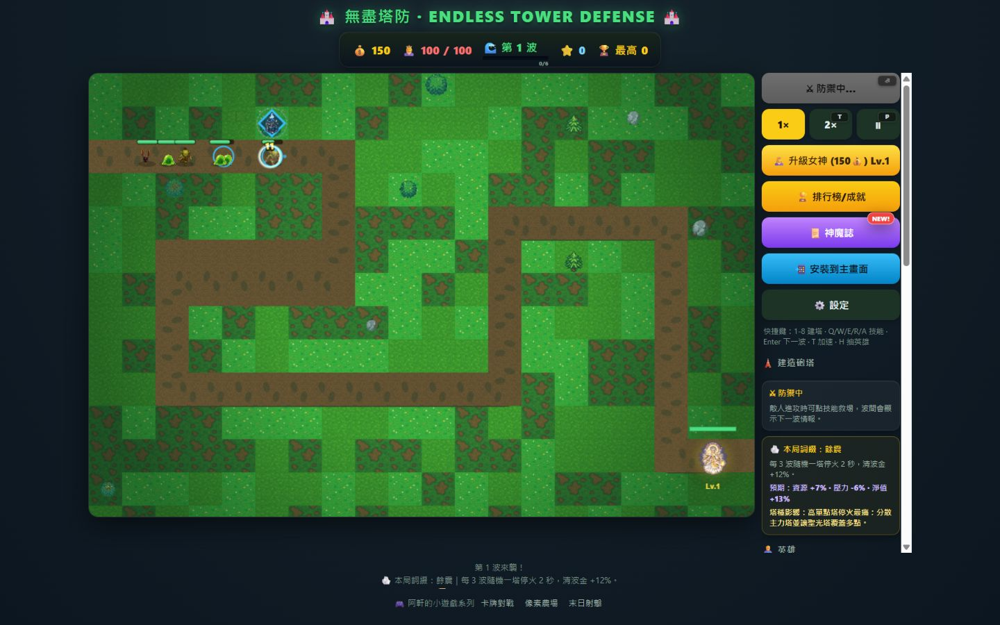
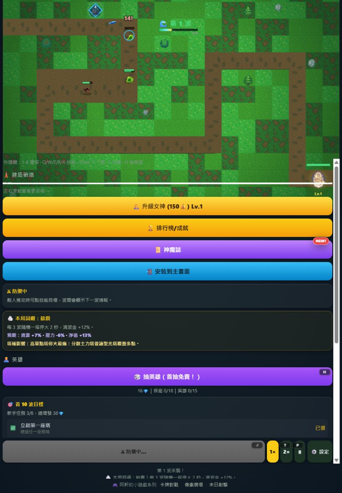
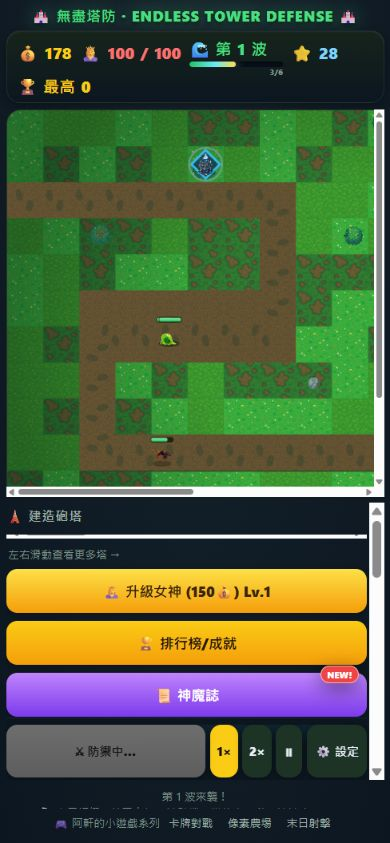

# Codex 實作回報｜td R62 敵人真幀動畫

## 結論

R62 已移除 `drawEnemy()` 以單張圖片搭配正弦 bob／waddle／`scaleX`／`scaleY` 假裝走路的 P0 違規。18 種敵人全部改用同一張 Canvas 2D 圖集裁切：16 種一般敵人各 4 幀真走路姿勢，2 種 Boss 各 6 幀沉重步伐；每種另有 3 幀碎裂／倒塌死亡姿勢。所有走路幀兩兩 alpha 平均絕對差均嚴格大於 0.08，總體最低值為史萊姆的 **0.082193**。

## 動畫與執行期改造

- 圖集：`assets/enemies/enemy-animation-atlas.png`，1152×2304 RGBA，9 欄×18 列，每格 128×128。
- 每列 0–3 欄為一般走路幀；Boss 額外使用 4–5 欄；6–8 欄為 3 幀死亡姿勢。
- `walkDist` 決定步態相位，`animSeed` 讓不同個體錯開。凍結時位移與 `walkDist` 都停止，因此會停在當前幀。
- 低效能模式只在第 0 幀與對側姿勢幀間交替，仍是裁切真動畫，沒有退回整圖晃動。
- 受擊保留 `hitKick` 物理擊退，當前幀另疊白色剪影閃光。
- 死亡後保留敵人物件 0.28 秒，依序播放 3 幀碎裂／倒塌，後段淡出，播放完才從陣列移除。
- 每次繪製只呼叫既有 atlas `drawImage()` 裁切；主迴圈沒有建立逐幀圖片或動畫物件。
- `scripts/build-enemy-atlas.py` 可由保留的 walk strips 重建圖集、量測 JSON 與接觸表。

## 逐敵人驗收數據

數值為該敵人所有走路幀任兩幀之 alpha 通道平均絕對差的最小值；守門條件為 `> 0.08`。

| 敵人 ID | 走路幀 | 死亡幀 | 最小 alpha 差 |
|---|---:|---:|---:|
| `slime` | 4 | 3 | 0.082193 |
| `goblin` | 4 | 3 | 0.099993 |
| `orc` | 4 | 3 | 0.107517 |
| `bat` | 4 | 3 | 0.084983 |
| `frostwolf` | 4 | 3 | 0.165065 |
| `imp` | 4 | 3 | 0.115713 |
| `shieldman` | 4 | 3 | 0.123430 |
| `medic` | 4 | 3 | 0.085803 |
| `frostwraith` | 4 | 3 | 0.117440 |
| `lavagolem` | 4 | 3 | 0.156171 |
| `emberbat` | 4 | 3 | 0.119532 |
| `thunderronin` | 4 | 3 | 0.168858 |
| `abysshound` | 4 | 3 | 0.152550 |
| `silencer` | 4 | 3 | 0.126191 |
| `mirrorling` | 4 | 3 | 0.104988 |
| `warden` | 4 | 3 | 0.087943 |
| `yaksha`（Boss） | 6 | 3 | 0.134195 |
| `boss`（Boss） | 6 | 3 | 0.084976 |

完整兩兩數據：[enemy-alpha-diff.json](evidence/R62/enemy-alpha-diff.json)；逐敵人原始走路 strip 位於 [walk-strips](evidence/R62/walk-strips/)；全圖集接觸表：[enemy-animation-contact.png](evidence/R62/enemy-animation-contact.png)。史萊姆與冰霜狼的第一版未達本輪門檻，已拒收並重製；表內均為重製後通過值。

## 前後對照

| 項目 | R61／修正前 | R62／修正後 |
|---|---|---|
| 行走姿勢 | 單張 sprite | 4 幀真姿勢；Boss 6 幀 |
| 動畫來源 | `sin()` bob、waddle、非等比縮放 | `walkDist + animSeed` 選 atlas 欄位 |
| 凍結 | 時鐘式外觀仍可能晃動 | 固定當前 walkDist 幀 |
| 受擊 | 物理 kick | 物理 kick＋白色受擊閃光 |
| 死亡 | 立即從敵人陣列消失 | 3 幀死亡姿勢＋0.28 秒淡出後移除 |
| 低效能 | 可能只保留整圖運動 | 兩張真正姿勢交替 |

`scripts/test-enemy-animation.js` 會獨立解碼 PNG、掃描 18 列所有走路幀組合、檢查死亡幀非重複，並靜態掃描 `drawEnemy()` 不得再出現 bob／waddle／縮放／旋轉／正弦假走路。

## 圖像製作紀錄

使用內建 ImageGen 編修既有 R61 敵人造型，不重設計。一般敵人的最終提示規格為：「以參考的既有敵人為基礎，製作嚴格水平排列的四幀走路循環 sprite strip；完整保留 R61 設計、畫風與配色；透明／純色可去背背景；四幀分別呈現接觸、下沉、跨步、抬升的真實肢體與身體姿勢；禁止用位移、bob 或縮放複製。」Boss 使用同一規格擴為六幀，並要求重量轉移、踏地與恢復形成沉重步伐。產出經去背、置中正規化後才打包成單一圖集。

## 自動化與視覺驗收

| 驗收 | 結果 |
|---|---|
| `npm test` | PASS，含 R62 alpha／靜態守門 |
| `npm run test:enemy-animation` | PASS，18/18，最低 0.082193 |
| `npm run test:e2e` | PASS，桌面／手機／矮視窗全綠，console error 與 pageerror 皆 0 |
| `npm run test:rwd` | PASS，9 視口×主畫面／設定，零違規、零水平溢出 |
| PWA | `0.6.2`／`td-r62-v1`，atlas 與動畫描述檔已加入 app shell |

塔的額外後座／閃光屬選做，本輪未擴張，優先把敵人真幀、受擊與死亡生命週期完整落地。
