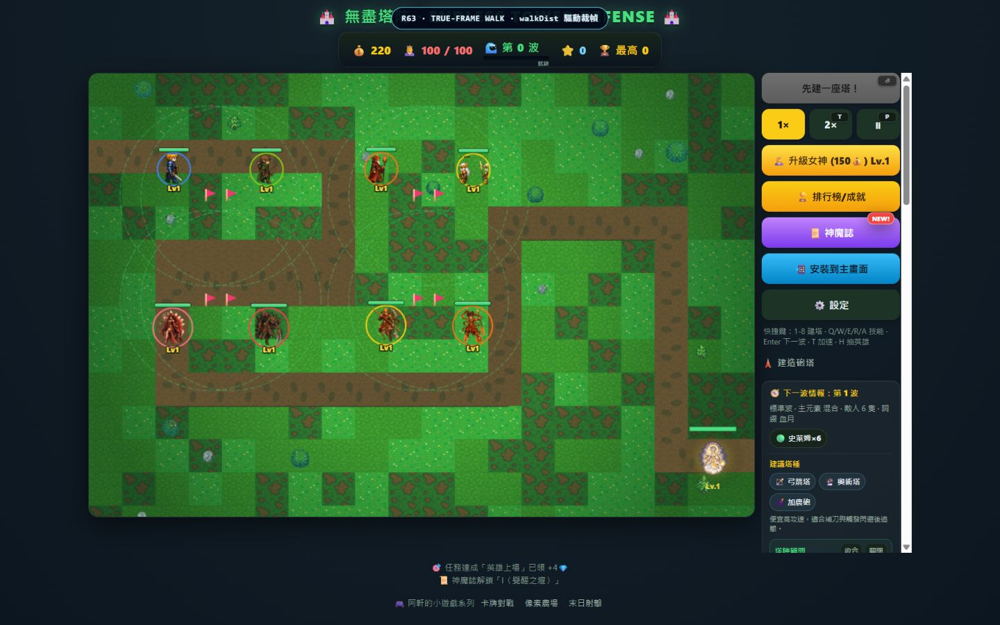
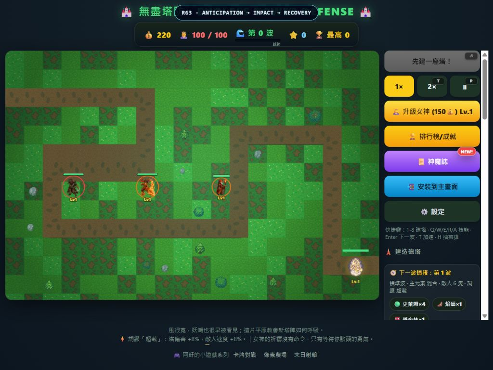
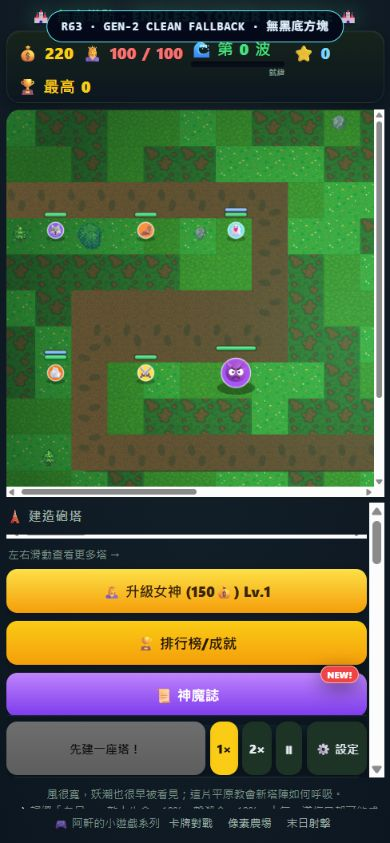

# 《無盡塔防》td R63 實作報告

## 結果

R63 已清償英雄動畫的雙重標準：15 位英雄全部改走單一真幀 atlas；移動以 `walkDist` 選幀，攻擊改為 `anticipation → impact → recovery` 狀態機，傷害不再於輸入當下結算。Gen-2 敵人的 atlas fallback 也不再讀取黑底 master PNG。

版本已提升為 `0.6.3`，PWA 快取版本為 `td-r63-v1`。

## A. 15 位英雄真幀走路

- 新增 `assets/heroes/hero-animation-atlas.png`：896×5376 RGBA、128×128 固定格、7 欄×42 列。
- 6 位基礎英雄保留 down／up／left／right 四方向，每方向 2 個有手腳接觸姿勢差異的真 walk 幀。
- 9 位神話英雄使用 4 個真 walk 幀；left 是建置期離線寫入的獨立 atlas 列，runtime 不做 `ctx.scale(-1, 1)` 假翻面。
- 第 4／5／6 欄固定為 anticipation／impact／recovery 姿勢。
- 英雄 physics root 與 visual animation 分離；`moveToward()` 只更新 root、`walkDist`、`moving`，`drawHero()` 只從 atlas 裁幀。
- `performanceLow` 只把 stride 由 8 提升到 14，仍然交替真幀，不退回整張靜態圖平移。

圖集守門逐一量測每個有效 walk 列的任兩幀 alpha mean absolute difference，門檻為嚴格大於 0.08；42 列全部通過，全域最小值為白素貞的 **0.083848**。完整量測在 [hero-alpha-diff.json](evidence/R63/hero-alpha-diff.json)，全圖接觸表在 [hero-animation-contact.png](evidence/R63/hero-animation-contact.png)。

產圖使用內建 ImageGen：提示固定 R61／R62 的可愛暗黑奇幻塔防風格、角色身分與配色，要求每格完整隔離於高對比 chroma 背景，walk 必須明顯交換手臂與腿部接觸姿勢，攻擊必須分成預備、命中、收招。生成來源經本機去背與 128×128 正規化後，只保留可重建的 [hero-strips](evidence/R63/hero-strips/)；一次性生成暫存來源已刪除。`scripts/build-hero-atlas.py` 已驗證可只靠這些 committed strips 重建 atlas 與量測證據。

## B. 英雄攻擊三段與命中時點

- `heroAttack()` 現在只鎖定目標、面向目標並進入 anticipation；不呼叫 `applyDamage()`、`killEnemy()`，也不建立 projectile。
- windup 結束才進 impact 並呼叫 resolver；近戰在此幀傷害，遠程在此幀建立 `activeHitbox` projectile。
- impact 結束後進 recovery，再回 idle；冷卻與三段動畫狀態彼此獨立。
- impact resolver 會重新驗證目標存活與 active range；目標離開範圍時揮空，不造成傷害、不補血、不給經驗。
- E2E 同時鎖住近戰與遠程：輸入當下、windup 期間 HP 不變；impact 才命中；recovery 不重複傷害；揮空為零傷害。

## C. Gen-2 黑底 fallback

`drawEnemyAtlasFrame()` 在 atlas 未就緒或驗收強制 fallback 時，改畫乾淨的 Canvas 圓形徽章與 emoji；不再讀取 `abysshound.png`、`emberbat.png`、`frostwraith.png`、`lavagolem.png`、`thunderronin.png`、`yaksha.png`，因此舊 master 的烤入黑底不會進到遊戲畫面。

## D. Canvas 2D 效能

- runtime 僅載入一張英雄 atlas，以單次 `drawImage(atlas, sx, sy, sw, sh, dx, dy, dw, dh)` 裁切。
- 動畫描述是啟動期凍結的共享 metadata；render hot path 不為選幀建立暫時物件。
- `walkDist`、`animSeed` 與攻擊欄位直接存在 hero entity；collider／root 不跟著視覺幀偏移。
- 低效能模式僅降低取樣頻率，未復活單圖 bob、scale、rotate 或 translate 假動畫。

## 守門與回歸

| 驗收 | 結果 |
|---|---|
| 15 位英雄 atlas 描述完整、42 列裁切合法 | PASS |
| 所有有效 walk 幀 pair alpha 差 > 0.08 | PASS，min 0.083848 |
| `drawHero()` 無 `def.sprite`／`def.sprites`／`drawSprite`／`ctx.scale`／`ctx.translate` | PASS |
| 攻擊輸入不立即傷害，impact resolver 才可命中 | PASS |
| 近戰、遠程、recovery 不重複、揮空零傷害 | PASS |
| Gen-2 fallback 不讀黑底 master PNG | PASS |
| `npm test` | PASS |
| `npm run test:e2e` | PASS；所有測試視口 console error 與 pageerror 為 0 |
| 秘密掃描 | PASS；排除 `.git` 為 0 命中 |

## 三視口證據

桌機 1440×900：8 位英雄行進中，實際 `walkDist` 選幀。

平板 1024×768：三位英雄分別固定在 anticipation、impact、recovery 真姿勢。

手機 390×844：強制 Gen-2 atlas fallback，6 種敵人全部是乾淨暫代，無黑方塊。

## 主要檔案

- `src/game.js`：walkDist、真幀 renderer、攻擊三段、impact resolver、乾淨 fallback、可重現驗收場景。
- `src/hero-animation.js`：15 位英雄 atlas row／frame metadata。
- `scripts/build-hero-atlas.py`：atlas、contact sheet、alpha metrics 可重建管線。
- `scripts/test-hero-animation.js`：alpha、靜態掃描、impact 時點與 fallback 守門。
- `scripts/test-td-e2e.js`：近／遠攻擊三段、揮空與 walkDist runtime 回歸。
- `index.html`、`sw.js`：R63 資產載入與 app-shell 快取。
