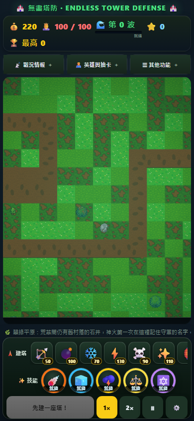
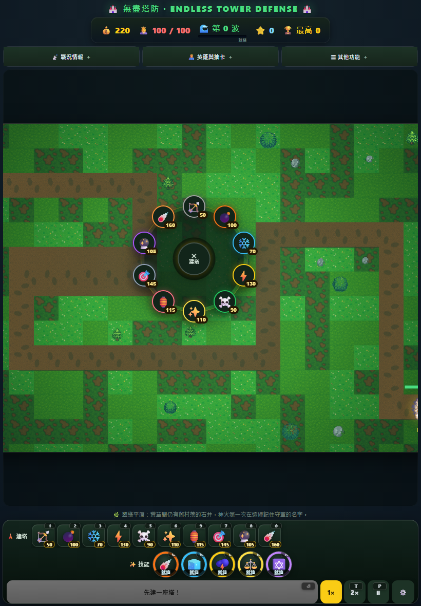
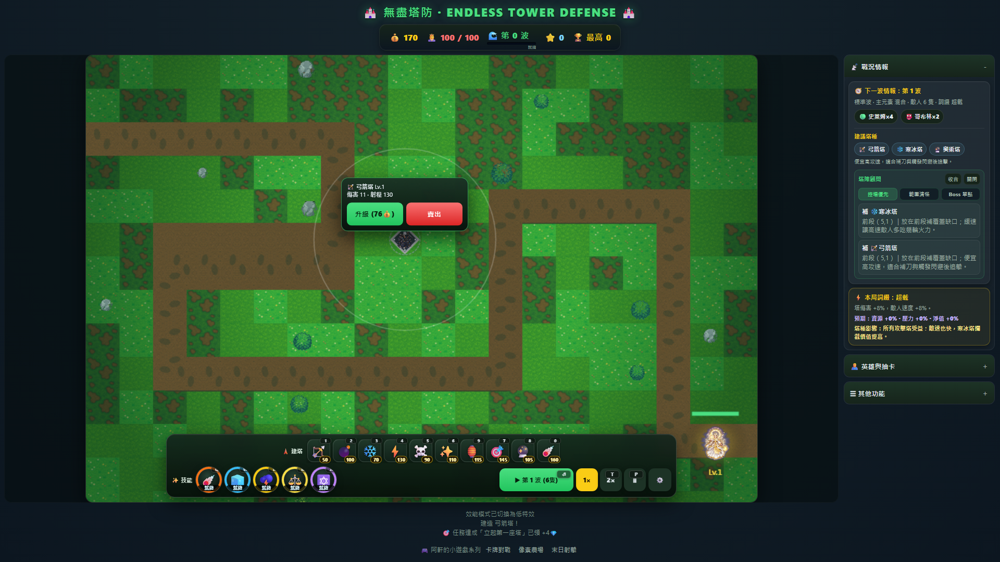

# 《無盡塔防》td R64 UX/RWD 重設計報告

R64 已將核心戰鬥操作從長側欄搬回戰場：10 塔小圖示 dock、5 技能冷卻環、開始／速度／暫停與設定組成常駐控制盤；空格、塔與女神皆可直接從 Canvas 點擊後就地操作。版本提升為 `0.6.4`，PWA 快取版本為 `td-r64-v1`。

## UX 稽核逐項對照

| 稽核／需求 | R64 落地結果 |
| --- | --- |
| P0 手機缺核心控制盤／A、B、G | `#sceneControls` 固定在手機視口下緣，第一列為 10 個 44px 塔鈕，第二列為 5 個圓形技能鈕與冷卻 `conic-gradient` 環，第三列為開始、1×／2×、暫停、設定。390×844、360×640、844×390 均不需垂直捲側欄即可操作。 |
| P0 桌機 Canvas 960px 硬上限／F | 移除桌機 `min(960px, …)` 上限，`ResizeObserver` 依 `#battlefieldStage` 剩餘寬高以 3:2 等比縮放。1920×1080 證據實測 Canvas CSS 尺寸為 1291×861，沒有變形。 |
| P1 23 區塊長側欄／G | 側欄改為「戰況情報／英雄與抽卡／其他功能」三個 `
` 抽屜；手機預設全收合且一次只展開一個。塔與技能不再存在側欄長列。 |
| P1 建塔兩步依賴面板／C | 無選塔狀態直接點合法空格，`buildOptionsAt()` 逐塔沿用原合法格、射程與金錢規則，只把當下付得起且可落地的塔放入就地輪盤；點輪盤塔種直接走原 `tryBuildTower()` 扣款與建造。既有 dock 選塔與桌機快捷鍵仍保留。 |
| P2 升級／賣出與塔脫節／D | `#selPanel` 移入戰場舞台，依所點塔的世界座標換算 CSS 座標，顯示等級、數值、升級價與賣出鈕；戰場捲動或縮放時會重新錨定。 |
| 女神按鈕常駐佔位／E | 面板不再有常駐女神升級鈕。點 Canvas 女神碰撞範圍後才顯示 `#goddessPanel`，含女神等級、HP、聖光狀態與升級價格。 |
| 不破壞邏輯／動畫 | 新增的 `selectedGoddess`、`buildMenuTarget` 只存在本局 UI state，不進存檔。塔成本、數值、升級、出售、技能與存檔 schema 均未改；R62 敵人與 R63 英雄動畫檔未修改。 |

## 互動與 RWD 細節

- 建塔 dock 保留 `1–0` 快捷鍵、金錢不足灰階與 `aria-disabled`；手機以單列水平滑動容納全部 10 塔，不再回長面板找塔。
- 技能 dock 保留 `Q/W/E/R/A`，冷卻秒數與環形比例同步，選定技能另有高亮。
- 場景 popover 使用 Canvas 邏輯座標轉換為舞台座標，並在邊緣自動改為向下展開，避免超出戰場。
- 新增穩定 selector：`data-testid="mobile-control-deck"`、`build-dock`、`skill-dock`、`build-wheel`、`tower-action-bubble`、`goddess-action-bubble`。
- RWD 守門新增 1920×1080 Canvas 放大／3:2 比例檢查，以及手機固定控制盤、10 塔、5 技能、44px 觸控目標與就地操作檢查。

## 改動檔案

- `index.html`：R64 戰場舞台、控制盤、抽屜、輪盤／氣泡 DOM 與完整 RWD 樣式。
- `src/game.js`：就地建塔候選、直接建造、女神／塔／空格 Canvas 點擊路由與場景選單狀態。
- `src/ui.js`：44px 建塔 dock、技能冷卻環、輪盤渲染、popovers 座標錨定、Canvas 桌機等比放大與手機抽屜管理。
- `scripts/test-config.js`：R64 DOM／selector 結構守門。
- `scripts/test-rwd-matrix.js`：固定控制盤、水平 dock、44px 觸控與桌機 Canvas 放大守門。
- `scripts/test-td-e2e.js`：直接點空格輪盤、只列可負擔塔、直接點女神、抽屜與穩定 selector 回歸。
- `scripts/capture-r64-evidence.js`：以真 Canvas 點擊重現三視口 evidence。
- `package.json`、`package-lock.json`、`README.md`、`sw.js`：`0.6.4`／`td-r64-v1` 版本同步。

## 三視口證據

### 手機 390×844：底部建塔 dock＋技能盤＋波控

Canvas 724×483 可平移；控制盤底緣 840px，完整位於 844px 視口內。

### 平板 820×1180：直接點空格的就地建塔輪盤

輪盤只列該格合法且目前付得起的塔，中央可取消。

### 桌機 1920×1080：放大 Canvas＋塔旁升級／賣出氣泡

Canvas CSS 尺寸 1291×861，維持 3:2；操作氣泡直接錨定所點塔。

## 驗證

- `npm test`：PASS，包含 R62 敵人與 R63 英雄真幀動畫守門。
- `npm run test:e2e`：PASS，桌機／平板／手機主流程、R64 場景互動、PWA 與動畫攻擊時點全通過。
- `npm run test:rwd`：PASS，9 視口 × 主畫面／設定共 18 組零違規、頁捲歸零、無水平溢出。
- `node scripts/capture-r64-evidence.js`：PASS，三張證據可重現。
- 秘密掃描：排除 `.git`、`node_modules` 後指定 pattern 零命中。

